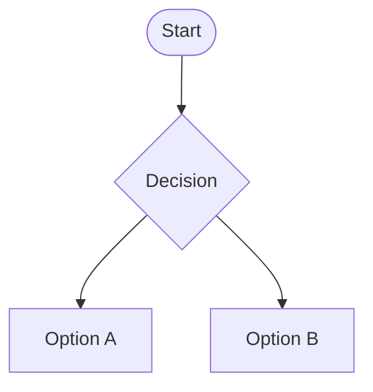

# Meu Projeto 3
## Configuração
- Instalar Python
- Instalar Vscode
- Executar codigo
```python
python script.py
```
## Arquitetura


```mermaid
flowchart TD
        A(["Start"])
        A --> B{"Decision"}
        B --> C["Option A"]
        B --> D["Option B"]
```

